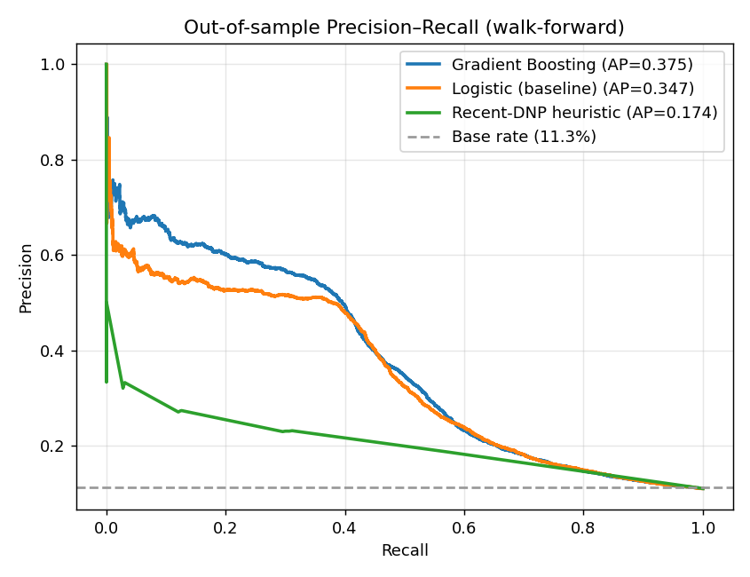
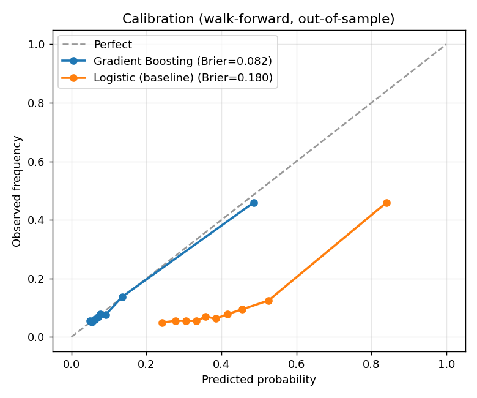
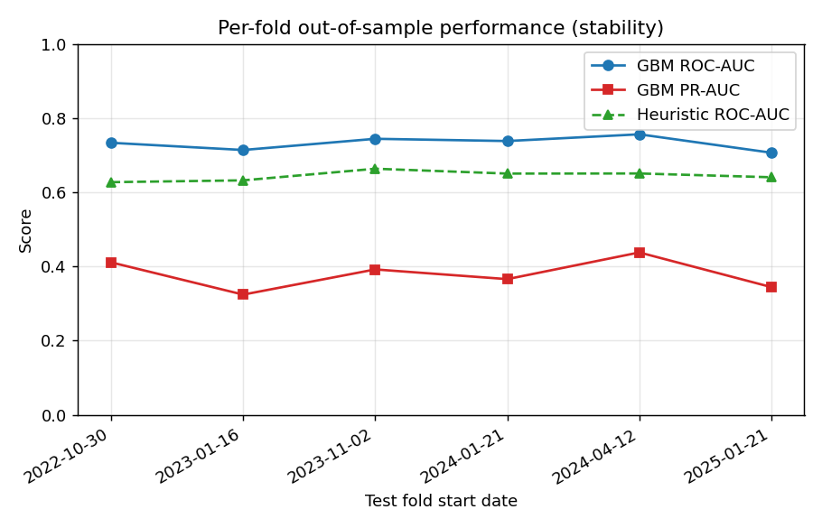
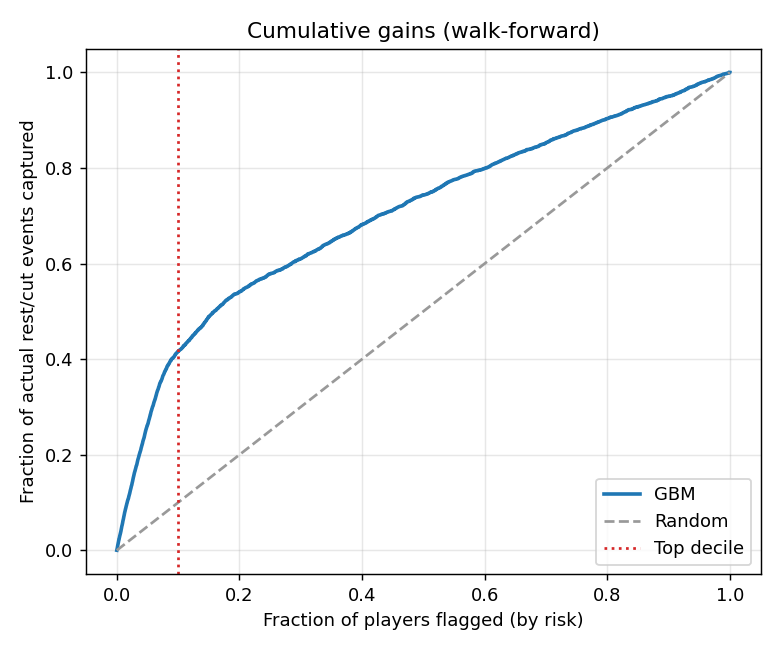
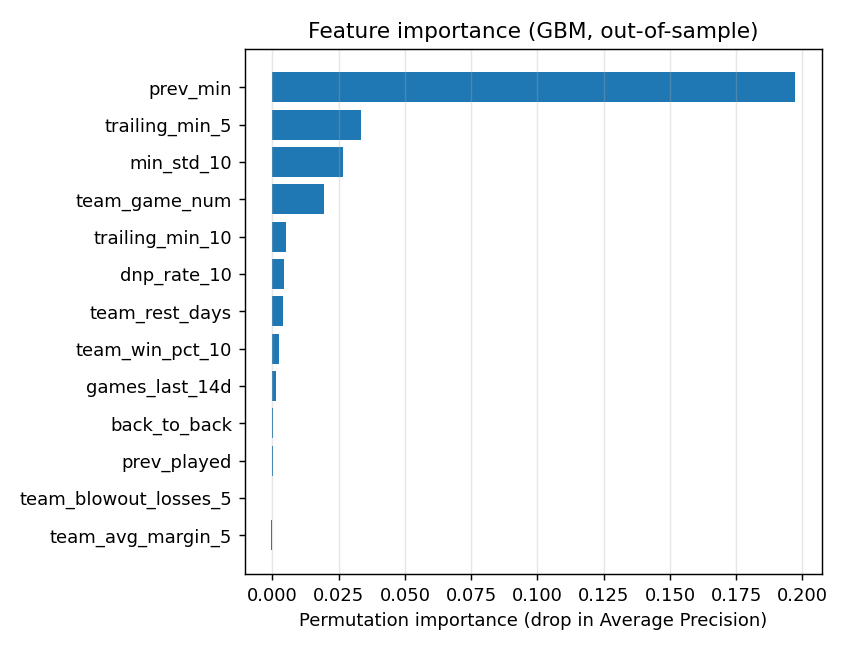

# NBA Player Availability Signal

> Predicting, *before tip-off*, which rotation players will be **rested or have their minutes cut** — validated with walk-forward testing on real ground truth.

---

## Why this exists

NBA rosters are increasingly managed for *load* and *draft position*, not just for winning tonight. Star players sit on back-to-backs; veterans on eliminated or tanking teams get quietly shut down. These "healthy DNPs" are worth real money to daily-fantasy players and are systematically **under-predicted by official injury reports**, which are reactive and often published only hours before tip-off.

This project builds a **forward-looking availability model**: for every rotation player heading into their team's next game, it estimates the probability of a *significant minutes drop or DNP*, using only information known before the game.

Unlike a "detect tanking after the fact" heuristic, the target here is **objective and self-labeling** — we simply observe how many minutes the player actually ended up playing. No hand-picked labels, no circular reasoning.

---

## The signal in one line

For each `(player, game)` with only pre-game information:

```
P( next-game minutes < 0.5 x trailing-10-game average, OR did-not-play )
```

Everything is validated with **expanding-window walk-forward** splits (train on the past, predict the unseen future) and reported against a naive baseline — never in-sample.

---

## Method

| Stage | What happens |
|-------|--------------|
| **Ingest** | Full-season player game logs from the NBA Stats API (one call per season, cached to Parquet) |
| **Panel reconstruction** | Rebuild a *complete* player x team-game panel, inferring DNPs (rotation players absent from the box score within their tenure) |
| **Features** | Strictly causal, pre-game features: rest days, back-to-backs, trailing minutes/volatility, recent role, team form, blowout exposure, season phase |
| **Labels** | Objective: actual next-game minutes vs. the player's own trailing baseline |
| **Validate** | Expanding-window walk-forward; calibrated gradient-boosted classifier; per-fold + pooled metrics vs. baseline |

## Honest limitations (documented up front)

- The box score only lists players who **played**, so DNPs are *inferred* from absence within a player's tenure. This conflates rest, injury, and coach's-decision DNPs — the model predicts **unavailability of any kind**, not tanking specifically. This is stated deliberately: separating rest from injury requires official injury-report ingestion (roadmap below).
- Mid-season trades and G-League two-way movement can create false "absences"; tenure-clipping mitigates but does not eliminate this.
- This is a **medium-frequency roster signal**, not a tick-level trading edge.

---

## Results

Trained and validated on **54,478 rotation-player games** across four seasons (2021-22 → 2024-25), with an **11.3% event base rate**. All numbers below are **out-of-sample**, pooled across 6 expanding-window walk-forward folds — the model never sees the period it's scored on.

| Model | ROC-AUC | PR-AUC | Brier | Lift @ top decile |
|-------|:------:|:------:|:-----:|:-----------------:|
| Base rate (reference) | 0.494 | 0.109 | 0.098 | 0.94x |
| Recent-DNP heuristic | 0.644 | 0.174 | 0.099 | 2.14x |
| Logistic regression | 0.729 | 0.347 | **0.180** | 4.16x |
| **Gradient Boosting** | **0.730** | **0.375** | **0.082** | **4.16x** |

**What the headline number means:** of the 10% of players the model flags as highest-risk on a given slate, **~47% actually sit or get their minutes cut** — a **4.2x lift** over the 11.3% base rate. The gradient-booster also nearly halves the Brier score vs. the logistic baseline, so its probabilities are usable as-is (no post-hoc calibration needed).

**Stability:** performance is consistent across every fold from late-2022 to 2025 (ROC 0.706–0.756), not driven by one lucky period.

**Honesty note:** ROC ~0.73 on an inferred, noisy label is a *realistic* number, not a suspiciously clean one. Roughly one-fifth of a player's minutes drop is genuinely unpredictable from schedule/role/form alone — which is exactly why official injury reports (roadmap) would be the next lift.

### Figures

| | |
|---|---|
|  |  |
|  |  |



Feature importance (permutation, out-of-sample) is led by the player's recent minutes and minutes **volatility** — i.e., inconsistent-usage players are the most predictable rest candidates — followed by season progression (rest ramps up late-season, consistent with load management and tanking).

### Resume bullet (real numbers)

> Built an end-to-end NBA player-availability model on 54K+ rotation-player games, engineering strictly causal features from reconstructed box-score panels (recovering inferred DNPs) and validating with expanding-window walk-forward testing; the gradient-boosted classifier reached **0.73 ROC-AUC / 0.375 PR-AUC** out-of-sample with a **4.2x top-decile lift** over base rate and a well-calibrated 0.082 Brier score, beating naive and logistic baselines consistently across all folds.

---

## Reproduce it

```bash
pip install -r requirements.txt

# 1. Pull + cache raw season logs (few API calls)
python -m src.data --seasons 2021-22 2022-23 2023-24 2024-25

# 2. Run the full pipeline: panel -> features -> walk-forward -> metrics + plots
python run.py
```

Outputs land in `results/` (metrics JSON + PNG plots).

---

## Roadmap

- [ ] Ingest historical **official injury reports** to (a) separate rest from injury and (b) benchmark how much *earlier* this model flags shutdowns.
- [ ] Per-player minutes **regression** (not just the drop classifier) for direct DFS projections.
- [ ] Daily-slate dashboard + "value play" surfacing (backup minutes when a starter sits).
